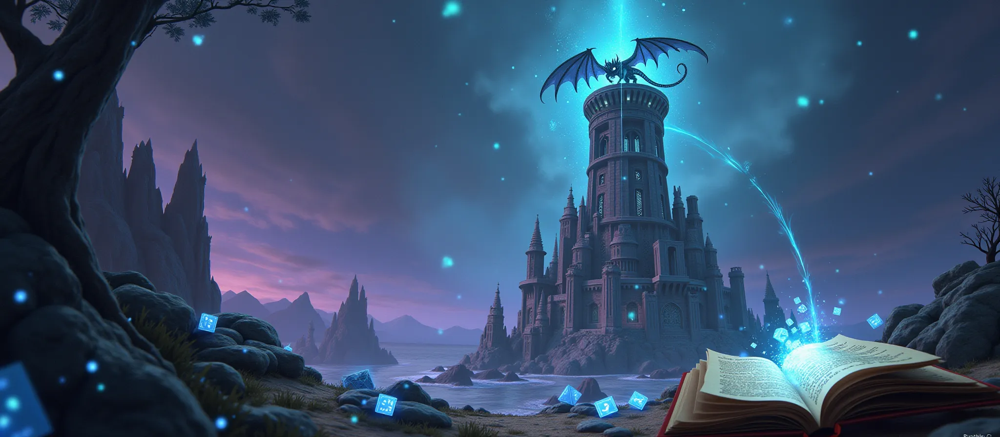

  <h1>🐉 Dungeons & Dragons RAG Exploration 🎲</h1>
  
<em>Exploring RAG techniques to create intelligent D&D assistants</em>

---

## Welcome to the D&D RAG Research Project

This comprehensive project explores advanced **Retrieval-Augmented Generation (RAG)** techniques applied to Dungeons & Dragons content, including rulebooks, lore, and game mechanics. Our goal is to create an intelligent D&D assistant capable of understanding complex queries about game rules, character mechanics, and strategic gameplay.

## 🎯 Project Goals

- **Intelligent Query Understanding**: Build systems that can parse complex D&D-related questions
- **Accurate Information Retrieval**: Implement advanced techniques to find the most relevant game content
- **Context-Aware Responses**: Generate answers that consider campaign context and player experience levels
- **Multi-Modal Knowledge**: Integrate rules, lore, statistics, and strategic advice

## 🔬 Research Focus Areas

Our research spans multiple cutting-edge areas in AI and information retrieval:

### Core RAG Optimization
Experimenting with chunk sizes, embedding models, and retrieval methods optimized for D&D content.

### Advanced Retrieval Methods
Exploring query expansion, agentic tool use, and interactive retrieval for complex multi-step questions.

### Knowledge Representation
Building graph-based systems and temporal knowledge graphs to capture D&D's interconnected mechanics.

### AI Agent Capabilities
Implementing long-term memory and persistent context for ongoing campaign assistance.

### Uncertainty and Reasoning
Developing confidence scoring, causal inference, and theory of mind modeling for more intelligent interactions.

## 🎲 Why D&D for RAG Research?

Dungeons & Dragons provides an ideal testbed for advanced RAG techniques because:

- **Complex Domain Knowledge**: Rich interconnected rules, lore, and mechanics
- **Ambiguous Queries**: Players often ask questions without precise terminology
- **Multi-Step Reasoning**: Many questions require synthesizing information from multiple sources
- **Temporal Dynamics**: Game narratives unfold over time, requiring understanding of story progression and cause-and-effect relationships
- **Contextual Personalization**: Each campaign has unique house rules, character builds, and narrative contexts that demand adaptive responses
