# Traditional RAG

A foundational implementation of **Retrieval-Augmented Generation (RAG)**.

## 🎯 Overview

This traditional RAG implementation demonstrates the core principles of combining retrieval and generation for question-answering tasks.
Using D&D character data as our knowledge base, we build a system that can semantically search through game content and generate contextually relevant answers.

## 🔄 The RAG Workflow

Our traditional RAG system follows a straightforward but powerful three-phase approach:

```mermaid
flowchart TD
    A[📚 Raw Documents] --> B[📝 Text Splitting]
    B --> C[🧠 Embedding Generation]
    C --> D[🗃️ Vector Database Storage]
    
    E[❓ User Question] --> F[🔍 Semantic Search]
    F --> G[📋 Retrieved Context]
    G --> H[🤖 LLM Generation]
    H --> I[✨ Final Answer]
    
    D -.-> F
    E --> H
    
    subgraph "Phase 1: Document Indexing"
        A
        B
        C
        D
    end
    
    subgraph "Phase 2: Query Processing"
        E
        F
        G
    end
    
    subgraph "Phase 3: Answer Generation"
        H
        I
    end    
```

